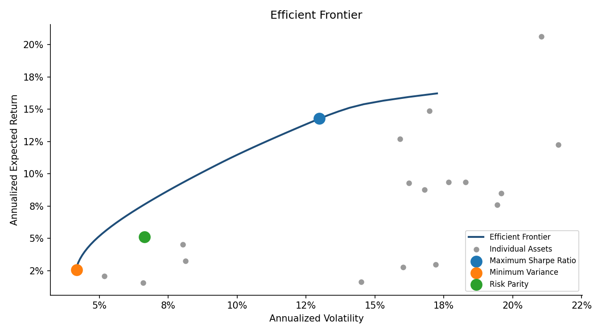
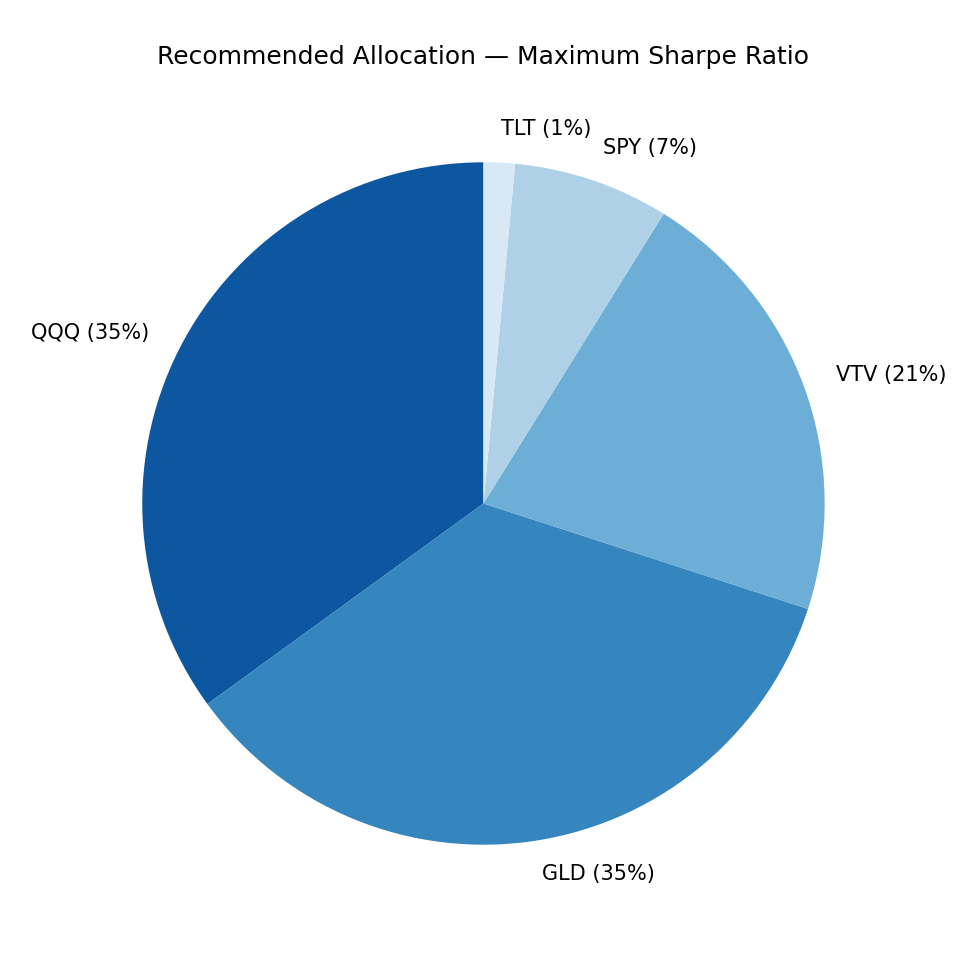
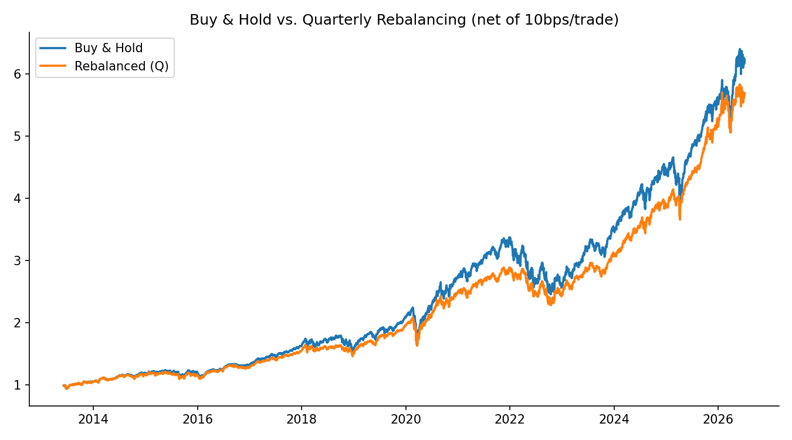
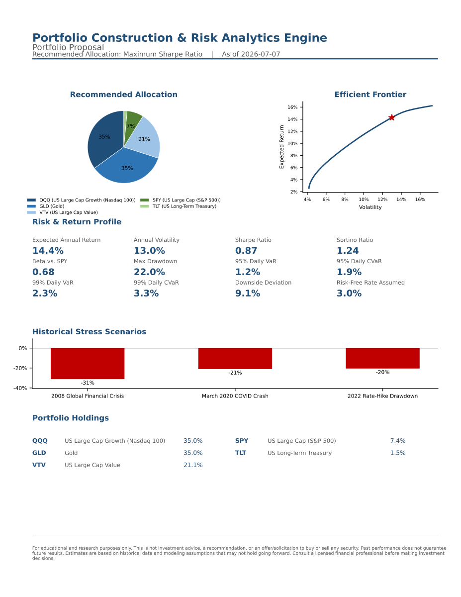

# Portfolio Construction & Risk Analytics Engine

A Python platform that takes a list of tickers and constraints, builds an efficient
frontier, recommends optimal portfolios under several objectives, and produces an
institutional-quality risk report — with an interactive Streamlit app and a static
Jupyter walkthrough.

> **Disclaimer:** This project is for **educational and research purposes only**. It
> does not constitute investment advice, a recommendation, or an offer/solicitation to
> buy or sell any security. All figures are derived from historical data and modeling
> assumptions that may not hold in the future. Past performance does not guarantee
> future results. Consult a licensed financial professional before making investment
> decisions.

## What it does

- Downloads 10+ years of adjusted daily prices for a configurable multi-asset universe
  (default: 18 ETFs spanning US equity, international equity, bonds, REITs, and
  commodities) via `yfinance`, cached locally as parquet/CSV.
- Estimates annualized returns and covariance with a choice of **sample covariance** or
  **Ledoit-Wolf shrinkage**.
- Solves for the **Maximum Sharpe Ratio**, **Minimum Variance**, and **Risk Parity**
  portfolios, and traces a 50+ point **efficient frontier** — all under configurable
  long-only / max-weight-per-asset constraints.
- Regresses each asset (and the recommended portfolio) against the **Fama-French 3- or
  5-factor model** to report factor loadings, alpha, and R².
- Computes a full risk report: historical **VaR/CVaR** at 95%/99%, **max drawdown**,
  **downside deviation**, and **beta** to a benchmark.
- Replays three historical **stress windows** (2008 GFC, March 2020 COVID crash, 2022
  rate-hike drawdown) and runs a **10,000-path bootstrapped Monte Carlo** simulation of
  1-year and 5-year outcomes.
- Backtests **buy-and-hold vs. quarterly rebalancing**, net of a configurable
  transaction-cost assumption.
- Exports a one-page, advisor-style **PDF portfolio proposal**.

## Screenshots

**Efficient frontier with the three recommended portfolios highlighted:**



**Recommended allocation:**



**Buy-and-hold vs. quarterly-rebalanced backtest, net of transaction costs:**



**One-page PDF portfolio proposal** (see [`portfolio_risk_engine/reporting/pdf_report.py`](portfolio_risk_engine/reporting/pdf_report.py)):



*(Charts above were generated directly from this codebase; the Streamlit app renders
the same data as interactive Plotly charts.)*

## Quickstart

```bash
git clone <your-fork-url>
cd portfolio-risk-engine
python3 -m venv .venv
source .venv/bin/activate          # Windows: .venv\Scripts\activate
pip install -r requirements.txt

# Launch the interactive app
streamlit run app/streamlit_app.py

# Or run the tests
pytest

# Or open the walkthrough notebook
jupyter lab notebooks/walkthrough.ipynb
```

The first run downloads price history via `yfinance` and Fama-French factor data from
Ken French's data library; both are cached under `data_cache/` so subsequent runs are
fast and mostly offline.

### Deploying to Streamlit Community Cloud

Push this repo to GitHub, then point Streamlit Community Cloud at `app/streamlit_app.py`
with `requirements.txt` as the dependency file. No secrets are required — all data
sources (`yfinance`, Ken French's data library) are public.

## Methodology, in plain English

### Mean-variance optimization

Modern Portfolio Theory says you can't just chase the highest-returning assets — what
matters is how assets move *together*. A portfolio's risk depends on each asset's
volatility **and** its correlation with everything else. The **efficient frontier** is
the set of portfolios that deliver the highest expected return for every level of risk;
anything below it is leaving return on the table for the risk you're taking.

This engine solves three classic points on (or near) that frontier:

- **Minimum Variance** — the single lowest-volatility portfolio, full stop.
- **Maximum Sharpe Ratio** — the portfolio with the best return-per-unit-of-risk
  (solved as a convex quadratic program via the standard Cornuejols-Tütüncü
  change of variables, not a heuristic search).
- **Risk Parity (Equal Risk Contribution)** — instead of allocating *capital* equally,
  it allocates *risk* equally, so no single asset (typically equities) secretly
  dominates the portfolio's ups and downs.

### Why shrinkage helps

The covariance matrix has to be *estimated* from historical data, and with 18 assets
and a few thousand daily observations, the raw ("sample") covariance matrix is noisy —
its largest and smallest eigenvalues are systematically distorted by estimation error.
A mean-variance optimizer is very good at finding and exploiting that noise, which is
exactly how you get "optimal" portfolios that are wildly concentrated and fall apart
out-of-sample.

**Ledoit-Wolf shrinkage** blends the noisy sample covariance with a simple, structured
target (a scaled identity matrix), choosing the blend weight analytically to minimize
expected estimation error. It's a small, deliberate amount of bias in exchange for a
much bigger reduction in variance — in practice this usually means more diversified,
more stable weights. This engine lets you toggle between the two estimators to see the
difference directly.

### What VaR and CVaR mean

- **Value at Risk (VaR)** at 95% confidence answers: "What's the loss threshold that
  historical daily returns crossed only 5% of the time?" A 95% VaR of 1.5% means
  losses worse than 1.5% happened on about 1 day in 20.
- **Conditional VaR (CVaR / Expected Shortfall)** answers the follow-up question: "given
  that we did blow through VaR, how bad was it on average?" CVaR is always at least as
  large as VaR, and it's the more informative number for genuinely fat-tailed markets,
  since VaR alone says nothing about how severe the tail beyond the threshold actually is.

Both are computed here via **historical simulation** (the empirical quantile of
realized returns), not a Gaussian assumption — real asset returns have fatter tails than
a normal distribution, so a parametric VaR would understate the risk.

### Stress testing and Monte Carlo

Historical VaR/CVaR describe "typical" bad days; they don't capture what happens in a
genuine crisis. The stress-test module replays the portfolio through the **2008 Global
Financial Crisis**, the **March 2020 COVID crash**, and the **2022 rate-hike drawdown**
using each asset's actual historical returns during those windows (an asset that didn't
exist yet during a given window is excluded and the remaining weights are rescaled,
with the exclusion reported explicitly rather than silently distorting the result).

The **Monte Carlo simulation** takes a different angle: instead of one historical path,
it resamples the portfolio's own daily return history (via a block bootstrap, to
partially preserve volatility clustering) 10,000 times to build a distribution of
possible 1-year and 5-year outcomes — answering "how wide is the range of plausible
futures?" rather than "what happened once in the past?"

## Architecture

```
portfolio_risk_engine/
├── config.py              # default universe, constraints, stress windows, constants
├── estimators.py          # returns, sample & Ledoit-Wolf covariance
├── data/
│   └── loader.py          # yfinance fetch + parquet/CSV cache
├── optimization/
│   └── engine.py          # max Sharpe, min variance, risk parity, efficient frontier
├── factor/
│   └── fama_french.py     # Ken French data download + factor regression
├── risk/
│   ├── metrics.py         # VaR, CVaR, drawdown, downside deviation, beta
│   └── stress.py          # historical stress windows + Monte Carlo bootstrap
├── backtest/
│   └── rebalance.py       # buy-and-hold vs. periodic rebalancing, net of costs
└── reporting/
    ├── charts.py          # Plotly charts for the Streamlit app
    └── pdf_report.py       # one-page PDF proposal (matplotlib)

app/streamlit_app.py        # interactive Streamlit app tying it all together
notebooks/walkthrough.ipynb # static, pre-executed end-to-end walkthrough
tests/                      # pytest suite (offline, synthetic data)
```

Every module is type-hinted and independently testable; the Streamlit app and notebook
are both thin orchestration layers over the same `portfolio_risk_engine` package.

## Testing

```bash
pytest -v
```

The suite (35 tests) covers the optimization engine (constraint satisfaction, risk
parity's equal-risk-contribution property, frontier monotonicity) and the risk module
(VaR/CVaR ordering, max drawdown on a known path, beta recovery, Sortino/downside
deviation) using synthetic, seeded data — no network access required, runs in about a
second.

## Configuring the universe & constraints

Edit `portfolio_risk_engine/config.py` to change the default ticker universe, benchmark,
stress windows, or default constraints — or use the Streamlit sidebar to override any of
these live, per session, without touching code.

## License

For educational and research use. See the disclaimer at the top of this file.
